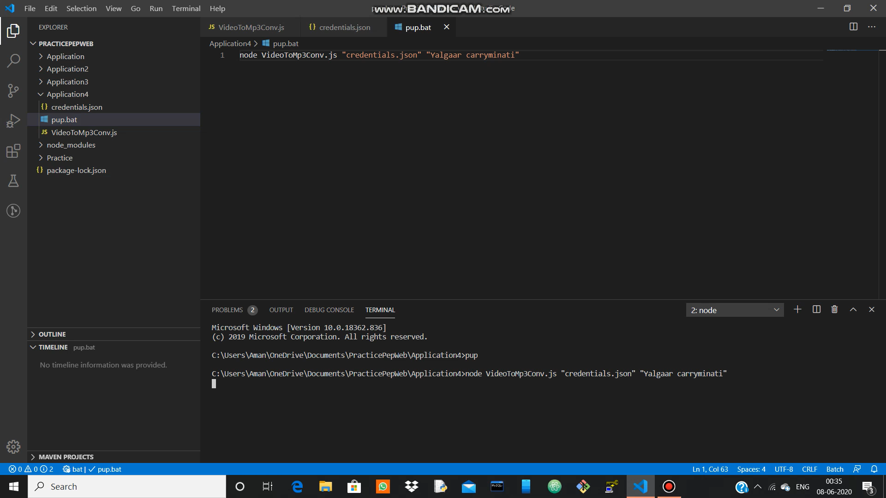

# YoutubeVideoTomp3
This project is based on puppeteer with async function and await. In this project Im using youtube video and convert the video in mp3

# Screen Shots
# 1.Command 

# 2.Copy url

# 3.Paste url on mp3 converter

